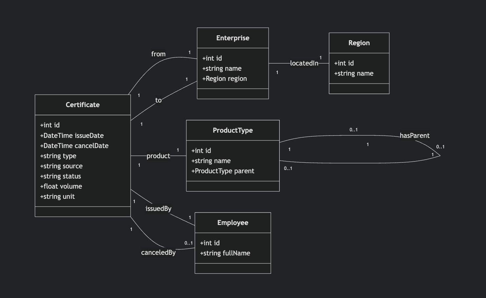
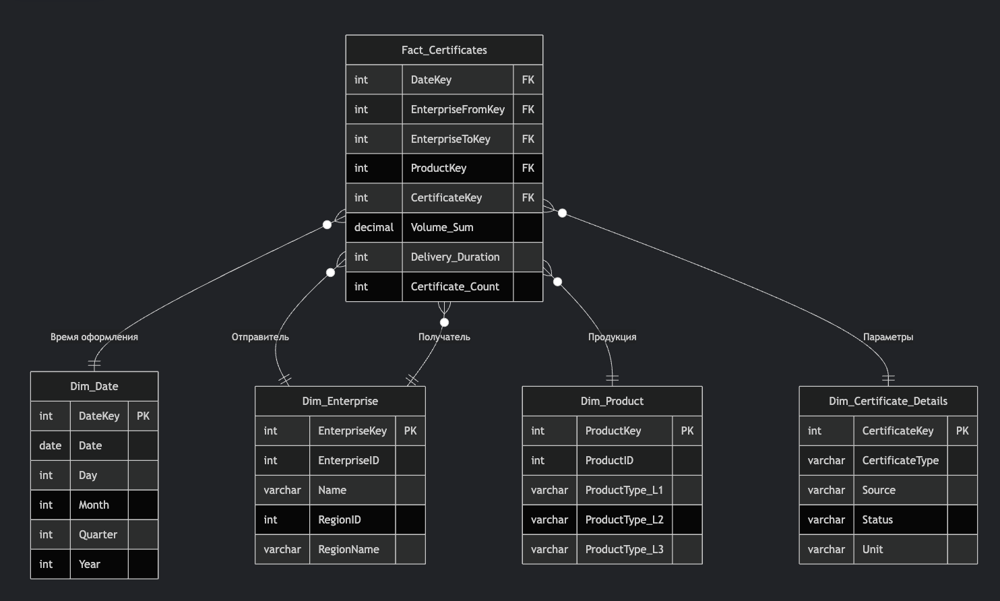
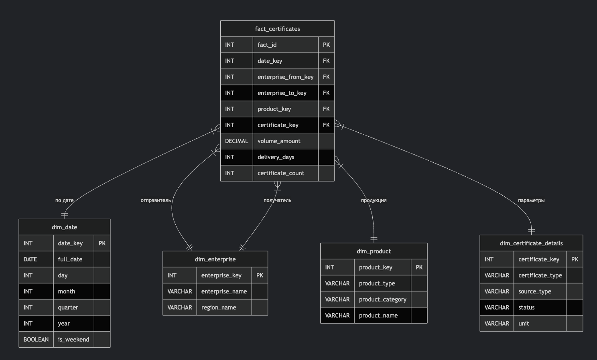

# Предметная область

Данные относятся к системе цифрового документооборота в **агропромышленном комплексе (АПК) Российской Федерации**, а именно к работе системы **«Меркурий»** (ФГИС «Меркурий»).

**«Меркурий»** — это государственная информационная система, предназначенная для электронной сертификации товаров животного происхождения. Её цель — прослеживаемость оборота продукции от производства до прилавка для обеспечения ветеринарной безопасности.

**Электронный ветеринарный сертификат (эВСД)** — это цифровой документ, который сопровождает каждую партию подконтрольной продукции (мясо, молоко, рыба и т.д.) при её перемещении. Без эВСД перевозить такую продукцию запрещено.

*   **Производственный эВСД:** Оформляется на предприятии-изготовителе (например, на мясокомбинате при отгрузке готовой продукции).
*   **Транспортный эВСД:** Оформляется для дальнейшей перепродажи или перевозки продукции (например, когда оптовый склад отгружает товар в магазин).

### Задача анализа данных

**Задача:** Повышение эффективности работы предприятий АПК и органов ветеринарного надзора за счет анализа потоков подконтрольной продукции и процессов электронной сертификации.

**Цель анализа:** Выявить скрытые закономерности, bottlenecks («узкие места») и точки роста, ответив на ключевые бизнес-вопросы.

---

# Сценарии использования аналитической подсистемы

1. Анализ грузопотоков
Тепловая карта для визуализации основных логистических маршрутов. Показывает суммарный объем и среднее время перевозок между регионами отправителя и получателя.

2. Эффективность логистики
Дашборд для выявления задержек в доставке. Анализирует среднее время между оформлением и гашением эВСД в разрезе предприятий и типов продукции.

3. Сезонность и спрос
Графики динамики объёмов перевозок по видам продукции. Выявляет сезонные пики и самые востребованные категории товаров.

4. Автоматизация процессов
Отчёт по доле автоматически оформленных эВСД (через Шлюз). Оценивает уровень цифровизации предприятий и нагрузку на специалистов.


# Модель транзакционных данных в виде UML Class Diagram



## Пояснение к модели:
1. Certificate (эВСД) - центральная сущность:
    * Содержит основные атрибуты: даты оформления/гашения, тип, источник, статус, объем
    * Имеет связи с предприятиями, продукцией и сотрудниками
2. Enterprise (Предприятие):
    * Хранит информацию об предприятиях-отправителях и получателях
    * Связано с регионом расположения
3. ProductType (Тип продукции):
    * Реализует иерархическую классификацию продукции (3 уровня)
    * Использует рекурсивную связь для построения дерева категорий
4. Employee (Сотрудник):
    * Содержит информацию о сертифицирующих специалистах
5. Region (Регион):
    * Справочник регионов РФ

# Логическая схема OLAP-куба


#### Таблица фактов (Fact_Certificates)

**Ключевое событие:** Оформление электронного ветеринарного сертификата (эВСД).

| Мера (Measure)        | Тип данных | Описание                                          | Агрегатная функция |
| :-------------------- | :--------- | :------------------------------------------------ | :----------------- |
| **Volume_Sum**        | Decimal    | Суммарный объем продукции по всем сертификатам   | SUM                |
| **Delivery_Duration** | Integer    | Длительность доставки (в часах или днях)          | AVG                |
| **Certificate_Count** | Integer    | Количество оформленных сертификатов               | COUNT              |

*Примечание: Duration вычисляется как разница между `Дата гашения` и `Дата оформления`.*

#### Измерения (Dimensions)

**а) Dim_Date (Временное измерение)**
*Иерархия:* Год → Квартал → Месяц → День
- DateKey (PK)
- Date
- Day
- Month
- Quarter
- Year
- IsWeekend

**б) Dim_Enterprise (Иерархическое измерение)**
*Иерархия:* Регион → Предприятие
- EnterpriseKey (PK)
- EnterpriseID
- Name
- RegionID
- RegionName

**в) Dim_Product (Измерение продукции)**
*Иерархия:* Тип продукции → Продукция → Вид продукции
- ProductKey (PK) 
- ProductID
- ProductType_L1
- ProductType_L2  
- ProductType_L3

**г) Dim_Certificate_Details (Измерение параметров сертификата)**
- CertificateKey (PK)
- CertificateType (пр/тр)
- Source (Шлюз/Веб)
- Status (оформлен/погашен)
- Unit (Единица измерения)

#### Схема "Звезда"




### Пояснения:

1.  **Таблица фактов** содержит ключи для соединения с измерениями и числовые показатели (меры) для анализа.
2.  **Временное измерение** (Dim_Date) позволяет анализировать данные в разрезе времени с любой гранулярностью.
3.  **Иерархическое измерение** (Dim_Enterprise) позволяет "сворачивать" данные от конкретного предприятия до региона.
4.  **Измерение продукции** (Dim_Product) имеет естественную иерархию из трех уровней для детального анализа.
5.  Связь с предприятием используется дважды: для отправителя и получателя (ролевое измерение).

Данная схема оптимально подходит для всех сформулированных ранее аналитических сценариев.

# Создание физической модели хранилища данных



```sql
CREATE DATABASE evsd_dwh;

CREATE TABLE dim_date (
    date_key INT PRIMARY KEY,
    full_date DATE,
    day INT,
    month INT,
    quarter INT,
    year INT,
    is_weekend BOOLEAN
);

CREATE TABLE dim_enterprise (
    enterprise_key INT PRIMARY KEY,
    enterprise_name VARCHAR(255),
    region_name VARCHAR(100)
);

CREATE TABLE dim_product (
    product_key INT PRIMARY KEY,
    product_type VARCHAR(100),
    product_category VARCHAR(100),
    product_name VARCHAR(100)
);

CREATE TABLE dim_certificate_details (
    certificate_key INT PRIMARY KEY,
    certificate_type VARCHAR(10),
    source_type VARCHAR(10),
    status VARCHAR(20),
    unit VARCHAR(20)
);

CREATE TABLE fact_certificates (
    fact_id INT PRIMARY KEY,
    date_key INT,
    enterprise_from_key INT,
    enterprise_to_key INT,
    product_key INT,
    certificate_key INT,
    volume_amount DECIMAL(15,2),
    delivery_days INT,
    certificate_count INT
);

ALTER TABLE fact_certificates 
ADD FOREIGN KEY (date_key) REFERENCES dim_date(date_key);

ALTER TABLE fact_certificates 
ADD FOREIGN KEY (enterprise_from_key) REFERENCES dim_enterprise(enterprise_key);

ALTER TABLE fact_certificates 
ADD FOREIGN KEY (enterprise_to_key) REFERENCES dim_enterprise(enterprise_key);

ALTER TABLE fact_certificates 
ADD FOREIGN KEY (product_key) REFERENCES dim_product(product_key);

ALTER TABLE fact_certificates 
ADD FOREIGN KEY (certificate_key) REFERENCES dim_certificate_details(certificate_key);

CREATE INDEX idx_date ON fact_certificates(date_key);
CREATE INDEX idx_enterprise ON fact_certificates(enterprise_from_key);
CREATE INDEX idx_product ON fact_certificates(product_key);
```

# SQL запрос для одного из сценариев

```sql
-- Анализ грузопотоков молочной продукции из Москвы
SELECT 
    de.region_name as регион_отправки,
    de2.region_name as регион_доставки,
    dp.product_name as продукция,
    SUM(fc.volume_amount) as общий_объем,
    AVG(fc.delivery_days) as среднее_время_доставки,
    COUNT(fc.fact_id) as количество_перевозок
FROM fact_certificates fc
JOIN dim_enterprise de ON fc.enterprise_from_key = de.enterprise_key
JOIN dim_enterprise de2 ON fc.enterprise_to_key = de2.enterprise_key
JOIN dim_product dp ON fc.product_key = dp.product_key
WHERE de.region_name = 'Москва'
AND dp.product_type = 'Молочка'
GROUP BY de.region_name, de2.region_name, dp.product_name
ORDER BY общий_объем DESC;
```

# Практическая реализация

## 1. Установка Metabase
```bash
wget https://downloads.metabase.com/v0.46.3/metabase.jar

java -jar metabase.jar
```

## 2. Готовые SQL-запросы для визуализации в Metabase

### Для тепловой карты грузопотоков:
```sql
SELECT 
    de1.region_name as откуда,
    de2.region_name as куда,
    SUM(volume_amount) as объем,
    AVG(delivery_days) as дни_доставки
FROM fact_certificates fc
JOIN dim_enterprise de1 ON fc.enterprise_from_key = de1.enterprise_key
JOIN dim_enterprise de2 ON fc.enterprise_to_key = de2.enterprise_key
GROUP BY de1.region_name, de2.region_name
```

### Для анализа эффективности логистики:
```sql
SELECT 
    de.enterprise_name as предприятие,
    dp.product_name as продукт,
    AVG(delivery_days) as среднее_время_доставки
FROM fact_certificates fc
JOIN dim_enterprise de ON fc.enterprise_from_key = de.enterprise_key
JOIN dim_product dp ON fc.product_key = dp.product_key
WHERE delivery_days IS NOT NULL
GROUP BY de.enterprise_name, dp.product_name
```

### Для анализа сезонности:
```sql
SELECT 
    month as месяц,
    product_type as тип_продукции,
    SUM(volume_amount) as объем
FROM fact_certificates fc
JOIN dim_date dd ON fc.date_key = dd.date_key
JOIN dim_product dp ON fc.product_key = dp.product_key
GROUP BY month, product_type
```

### Для анализа автоматизации:
```sql
SELECT 
    source_type as источник,
    COUNT(*) as количество,
    COUNT(*) * 100.0 / (SELECT COUNT(*) FROM fact_certificates) as процент
FROM fact_certificates fc
JOIN dim_certificate_details cd ON fc.certificate_key = cd.certificate_key
GROUP BY source_type
```

## 3. Простые шаги для создания дашборда в Metabase:

1. Подключение к БД: 
   - Админ → Настройки → Базы данных → Добавить базу данных
   - Ввести параметры подключения к PostgreSQL

2. Создание вопросов:
   - Создать → Новый вопрос → Родной запрос
   - Вставить один из SQL-запросов выше
   - Выбрать тип визуализации (таблица, график, карта)

3. Создание дашборда:
   - Создать → Новый дашборд
   - Добавить созданные вопросы на дашборд
   - Разместить вопросы как нужно
